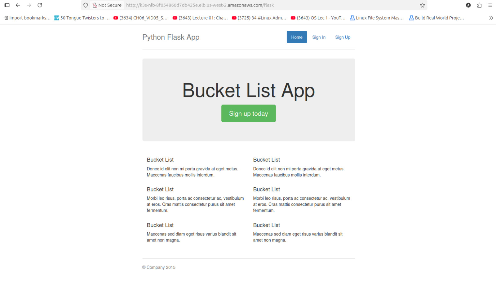
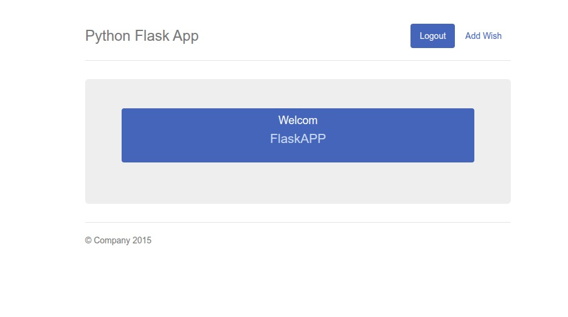
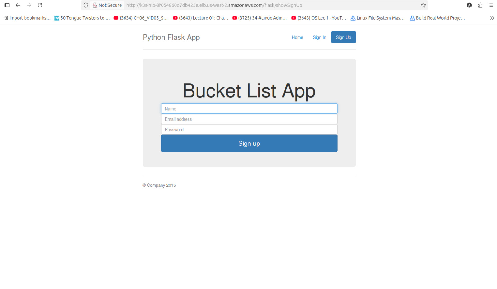
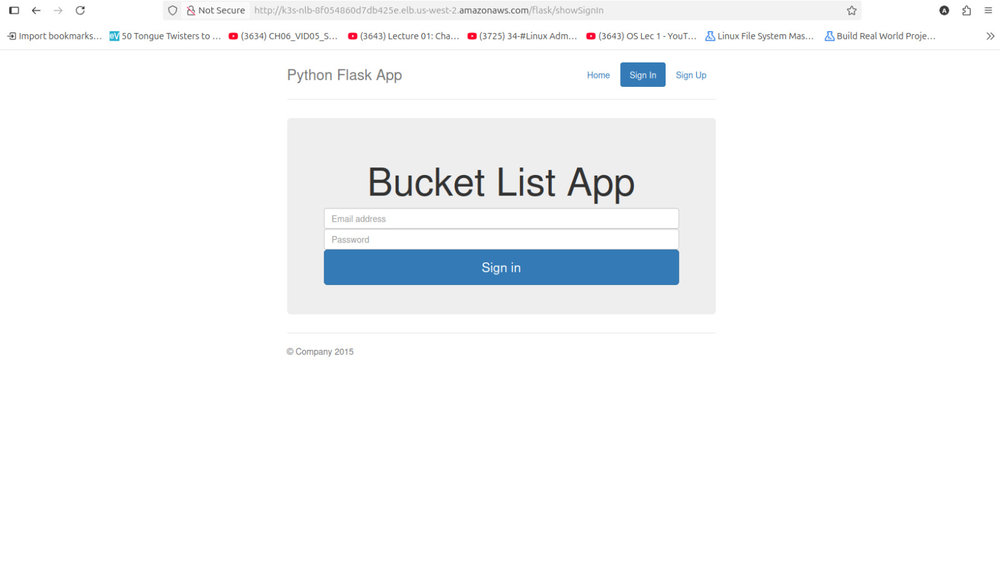
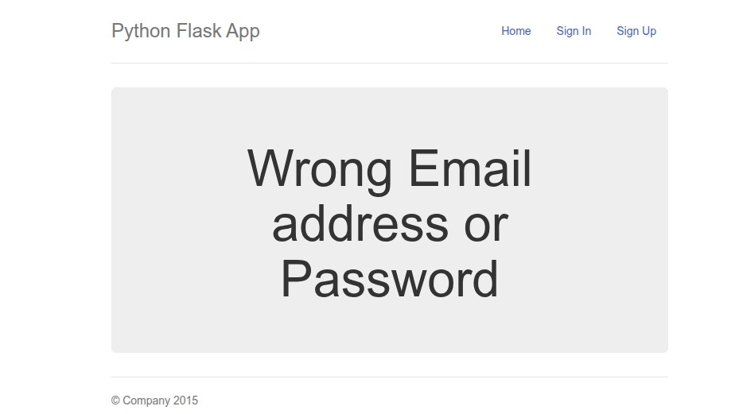

# DevOps Internship Project – FlaskApp with MySQL on K3s

## Overview
This project demonstrates a complete DevOps pipeline for deploying a Flask application backed by MySQL onto a lightweight Kubernetes (K3s) cluster.  
It covers the entire DevOps lifecycle including CI/CD with GitLab, containerization with Docker, orchestration with K3s, Infrastructure as Code with Terraform and Ansible, and GitOps with Argo CD.

---

## Project Workflow

### CI/CD with GitLab
The pipeline is defined in `.gitlab-ci.yml` and runs automatically on changes.

#### Pipeline Triggers
- Push to `testing` branch runs the full pipeline and updates the image in `K8s/overlays/testing`.  
- Push to `main` branch runs the full pipeline and updates the image in `K8s/overlays/production`.  
- Argo CD detects overlay changes and deploys accordingly.

#### Pipeline Stages
1. **Test**  
   - Runs unit tests with `pytest` and generates coverage reports (`coverage.py`, target ≥ 80%).  

2. **Lint**  
   - Code linting with `flake8`.  

3. **SAST (Static Application Security Testing)**  
   - Runs `bandit` on the source code.  

4. **Dependency Scan**  
   - Runs `safety` to check for vulnerable Python dependencies.  

5. **Build and Push**  
   - Builds Docker images for FlaskApp and MySQL.  
   - Pushes images to DockerHub with unique pipeline tags.  

6. **Deployment Update (GitOps Integration)**  
   - If branch = `testing`, updates the image in `K8s/overlays/testing`.  
   - If branch = `main`, updates the image in `K8s/overlays/production`.  
   - Argo CD syncs the updated manifests automatically (testing) or via manual approval (production).  

---

### GitOps with Argo CD
Argo CD manages deployments to the cluster via overlays.

- **Application 1 – Overlay/Testing**  
  - Monitors `K8s/overlays/testing`.  
  - Auto-sync enabled.  
  - Deploys to the `testing` namespace.  

- **Application 2 – Overlay/Production**  
  - Monitors `K8s/overlays/production`.  
  - Manual sync required.  
  - Deploys to the `prod` namespace.  

---

### Kubernetes Deployment
- **Cluster:** K3s on AWS (1 control node and 1 worker node).  
- **Namespaces:** `testing` and `prod`.  
- **Ingress:** NGINX Ingress Controller routing `/flask` path to the Flask service.  

#### Enhancements
- Liveness and readiness probes.  
- PersistentVolumeClaim (PVC) for MySQL persistence.  
- Secrets for database and DockerHub credentials.  
- ConfigMaps for environment configurations.  
- Resource limits defined separately for testing and production.  

---

### Infrastructure with Terraform and Ansible
Infrastructure and cluster setup are fully automated.

#### Terraform
- Creates two subnets:  
  - Public subnet with EC2 hosting and Network Load Balancer.  
  - Private subnet with one control node EC2 and one worker node EC2.  
- Adds Internet Gateway, Elastic IP, and Route Tables.  
- Configures private nodes to reach the internet via NAT.  

#### Ansible
- Installs K3s on both master and worker nodes.  
- Deploys Argo CD and Argo CD CLI.  
- Uses modular roles for installation.  
- Orchestrated via a single playbook.  

---

## Environment Differences

| Feature      | Testing | Production |
|--------------|---------|------------|
| Replicas     | 1       | 3          |
| CPU Limit    | 200m    | 500m       |
| Memory Limit | 256Mi   | 1024Mi     |

#### Secrets and ConfigMaps
- Database credentials and DockerHub credentials stored as Kubernetes Secrets.  
- Configurations stored in ConfigMaps.  
- No plaintext secrets are committed to version control.  

#### Ingress
- `/flask` routed via NGINX Ingress Controller.  
- Secure access with path rewrites.  

#### Enhancements
- Liveness and readiness probes.  
- PVC for MySQL persistence.  
- ImagePullSecrets for private registries.  

---

## Validation and Testing
The deployment was validated with the following checks:

- FlaskApp ↔ MySQL connectivity tested.  
- Ingress path `/flask` accessible externally.  
- Secrets correctly injected.  
- PVC ensures MySQL data persistence.  
- Resource limits differ between testing and production.  
- Argo CD sync works for both testing (automatic) and production (manual).  

---

## Application Screenshots

Below are sample screenshots of the Flask application to demonstrate deployed functionality.

### Home Page (`/flask`)

### Sign In (`/flask/app`)

### Sign Up (`/flask/signup`)

### User Dashboard (`/flask/signin`)

### User Dashboard (`/flask/validateLogin`)

## Summary
This project successfully integrates CI/CD, GitOps, Infrastructure as Code, and Kubernetes deployment into a single pipeline-driven workflow:  

- GitLab CI/CD automates build, test, lint, security scans, and Docker image pushes.  
- Argo CD handles GitOps-driven deployment into testing and production namespaces.  
- Terraform and Ansible automate AWS infrastructure (VPC, EC2, k3s) and cluster bootstrapping.  
- Kubernetes manages workloads with secure and scalable configurations.  

This end-to-end setup demonstrates a production-grade DevOps workflow.
